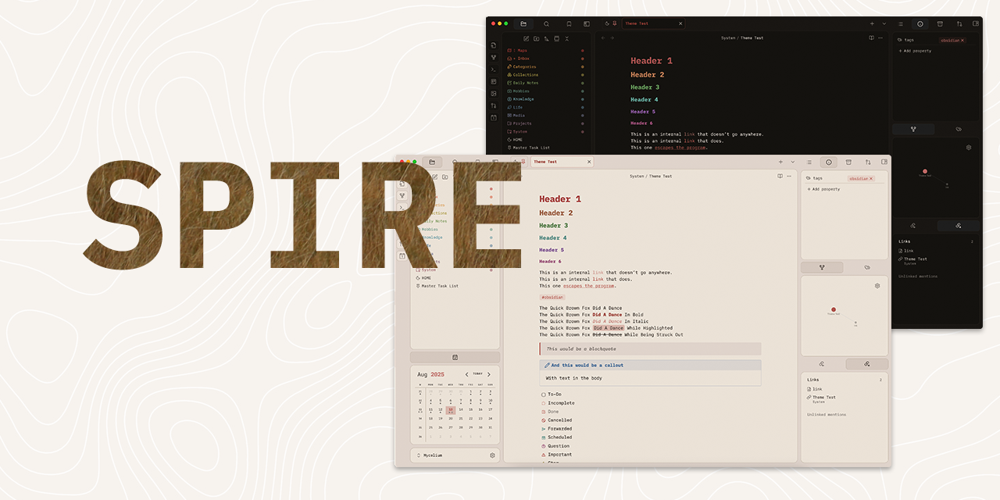
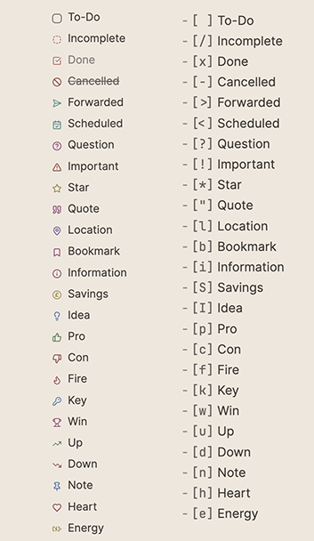
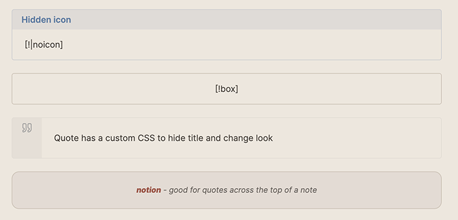

# SPIRE : My Personal Obsidian Theme

## About This Theme

This is my personal Obsidian theme, built specifically for my own workflow and preferences. I'm sharing it here in case anyone finds it useful, but please note that this theme comes with some important caveats.

## ⚠️ Important Disclaimers

- **Personal use theme**: This theme is customised specifically for my needs and the features I use
- **Not comprehensively tested**: Only tested with features I personally use in my daily workflow
- **Version compatibility**: Only tested on Obsidian version 1.8.10 and later
- **Not mobile optimised**: This theme is designed for desktop use only
- **No planned expansion**: I have no plans at the moment to develop this further for submission to the official Obsidian theme gallery
- **No Style Settings support**: This theme doesn't include Style Settings plugin compatibility

## What's Included

### Custom Features

- **Light/Dark colourscheme**
- **Custom checkboxes** - Special checkbox styling for various task states. Icons from Lucide.

  

- **Custom callouts** - Unique styling for several callout types

  

  - **[!|noicon]** - Hides callout icon
  - **[!box]** and **[!notion]** provide simple box styles
  - **[!quote]** is a tweaked version of the quote callout. Note that 'cite' still works as default.

### Third-Party Elements

The rainbow folder colours are adapted from [AnubisNekhet's](https://github.com/AnubisNekhet) brilliant [AnuPpuccin theme](https://github.com/AnubisNekhet/AnuPpuccin), though they've been significantly pared down to suit my minimalist preferences.

While I prefer a muted palette for my theme I do enjoy having more saturated folders. Colours can be tweaked inside the CSS.

## Installation

1. Download the theme files from this repository
2. Copy the Spire theme folder to your Obsidian themes directory:
   - **Windows**: `%APPDATA%\obsidian\themes\`
   - **macOS**: `~/Library/Application Support/obsidian/themes/`
   - **Linux**: `~/.config/obsidian/themes/`
3. Restart Obsidian
4. Go to Settings → Appearance → Themes and select this theme

## Customisation

The CSS is heavily commented to make modifications easier if you want to tweak things for your own use. Feel free to dive in and adjust colours, spacing, or any other elements to better suit your preferences.

## License

Feel free to download, use, and modify this theme however you'd like. If you make improvements, I'd love to see what you've done, though I can't promise to incorporate changes into this version.

---

_This theme works perfectly for my setup, but your mileage may vary. Happy note-taking!_
